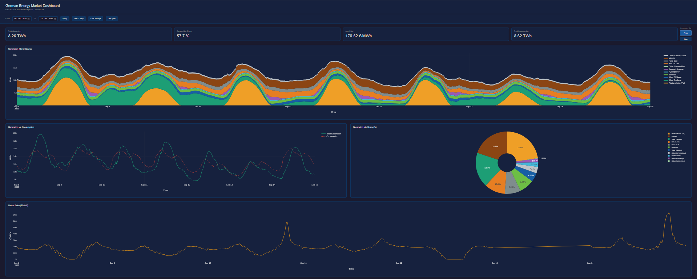
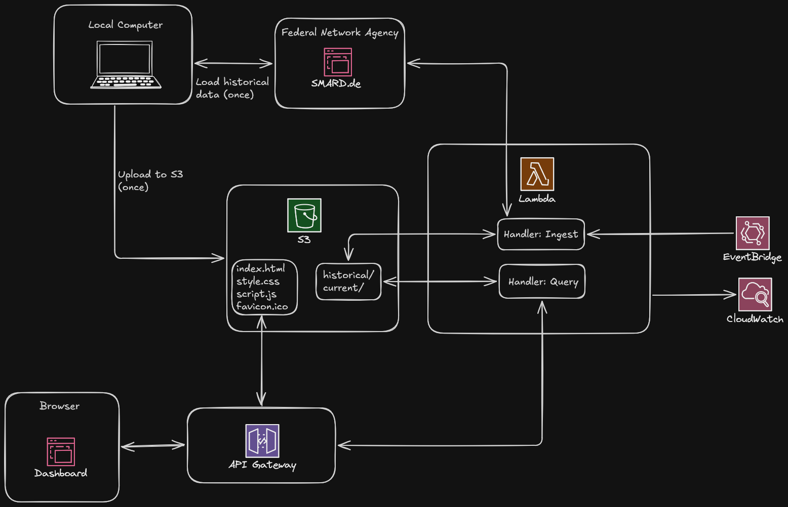

# ⚡ **SMARD Energy Data Pipeline**

     

## **Project Overview**
This data pipeline visualizes the data of the German energy market in a dashboard. It gives an overview of the generated and consumed power, the usage of the different energy sources and the market price for Germany.



The energy market data come from [Bundesnetzagentur | SMARD.de](https://www.smard.de/home), the website of the German Federal Network Agency. The data are published under the CC BY 4.0 licence.

## 📁 Repository Structure

```text
smard-energy-pipeline/
├── aws/
│   ├── lambda/
│   │   ├── ingest/
|   |   |   └── handler.py
│   │   └── query/
|   |       └── handler.py
│   ├── layer.zip
│   └── upload_to_s3.py
|
├── dashboard/
│   ├── backend/
|   |   └── server.py
│   ├── frontend/
|   |   ├── favicon.ico
|   |   ├── index.html
|   |   ├── script.js
|   |   └── style.css
│   └── requirements.txt
|
├── local/
│   ├── downloader.py
│   ├── main.py
│   └── requirements.txt
|
├── images/
│   ├── architecture.excalidraw
│   ├── architecture.png
│   └── dashboard.png
|
├── smard_pipeline/
│   ├── __init__.py
│   ├── config.py
|   ├── current_week.py
|   ├── ingest.py
|   ├── logging_config.py
|   ├── smard_api.py
|   ├── storage_s3.py
│   └── transformations.py
|
├── terraform/
│   ├── modules/
|   |   ├── api_gateway/
|   |   |   ├── main.tf
|   |   |   ├── outputs.tf
|   |   |   └── variables.tf
|   |   ├── eventbridge/
|   |   |   ├── main.tf
|   |   |   ├── outputs.tf
|   |   |   └── variables.tf
|   |   ├── iam/
|   |   |   ├── main.tf
|   |   |   ├── outputs.tf
|   |   |   └── variables.tf
|   |   ├── lambda/
|   |   |   ├── main.tf
|   |   |   ├── outputs.tf
|   |   |   └── variables.tf
|   |   ├── lambda_layer/
|   |   |   ├── main.tf
|   |   |   ├── outputs.tf
|   |   |   └── variables.tf
|   |   └── s3/
|   |       ├── main.tf
|   |       ├── outputs.tf
|   |       └── variables.tf
|   ├── locals.tf
|   ├── main.tf
|   ├── outputs.tf
|   ├── providers.tf
|   └── variables.tf
|
├── .gitignore
├── pyproject.toml
└── README.md
```


## 🏗️ Architecture & Technologies



### 🛠️ Used AWS Services
 * S3 Bucket
 * Lambda function and layer
 * API Gateway
 * EventBridge
 * CloudWatch

## 🚀 Getting started

1. Clone the repo to your local machine:
```bash
git clone https://github.com/HamsterHugo/smard-energy-pipeline.git
```

2. Create a virtual environment for Python
If you are using Visual Studio Code you can do it by executing the following command:
```bash
python -m venv .venv
```

You activate the virtual environment with the following command:
```bash
.venv\Scripts\activate
```

3. Install the local Python package `smard-pipeline`:
Once the virtual environment is installed and activated you have to install the local Python Package `smard-pipeline` by entering the following command into your terminal:
```bash
pip install -e .
```

4. Download and preprocess the historical data from SMARD.de
You have execute the Python scripts for downloading the timeseries. For that go to the folder `local/`:
```bash
cd local
```

If not already done, you have to install all the Python packages. For that enter the following command:
```bash
pip install -r requirements.txt
```

Now, you can download and preprocess the timeseries data from SMARD.de by using the script `main.py`. Here is a list of all valid commands:

* ``python main.py historical <category> <subcategory>``: Searches for the missing data of the given category and subcategory on your local disk and fetches them if needed.
* ``python main.py historical <category> all``: Searches for all missing data of all subcategories of the given category on your local disk and fetches them if needed.
* ``python main.py historical combine``: Combine all historical data from the merged timeseries to one table. Notice that nuclear energy and the market price are excluded. This is due to the fact that there are no data available for some time period (after 15th April 2023 for nuclear energy and before 1st October 2018 for market price).
* ``pyhton main.py merge <category> <subcategory>``: Merges all data blocks of the given category and subcategory to one timeseries.
* ``python main.py merge <category> all``: Merges all data blocks of all subcategories of the given category to one timeseries.
* ``python main.py current <category> <subcategory>``: Fetches the data of the given category and subcategory for the current week.
* ``python main.py current <category> all``: Fetches the data of all subcategories of the given category for the current week.
* ``python main.py current combine``: Combine all needed data for the dashboard of the current week to one table.

Replace `<category>` and `<subcategory>` with the names of the desired category and subcategory. The following table lists all categories and subcategories:

| 🗂️ **Category** | 📁 **Subcategory** |
|:--------------|:-----------------|
| Stromerzeugung | Braunkohle, Kernenergie, Wind Offshore, Wasserkraft, Sonstige Konventionelle, Sonstige Erneuerbare, Biomasse, Wind Onshore, Photovoltaik, Steinkohle, Pumpspeicher, Erdgas |
| Stromverbrauch | Gesamt (Netzlast), Residuallast, Pumpspeicher |
| Marktpreis | Deutschland-Luxemburg, Anrainer DE-LU, Belgien, Norwegen 2, Österreich, Dänemark 1, Dänemark 2, Frankreich, Italien (Nord), Niederlande, Polen 1, Polen 2, Schweiz, Slowenien, Tschechien, Ungarn |
| Prognostizierte Erzeugung | Offshore, Onshore, Photovoltaik, Sonstige, Wind und Photovoltaik, Gesamt |

For the dashboard you need all subcategories of `Stromerzeugung`. From the category `Stromverbrauch` you just need `Gesamt (Netzlast)` and `Residuallast`. For the category `Marktpreis` you only need `Deutschland-Luxemburg`. You can fetch the data with a command (`python main.py historical <category> <subcategory>`) for each category-subcategory pair or you can download all subcategories for one category at once with the command `python main.py historical <category> all`.

ℹ️ **Notice:** If you download all power generation data with the command `python main.py historical Stromerzeugung all`, be aware that this will take possibly more than one hour!

Since the Federal Network Agency publishes its data in weekly blocks you have to merges the timeseries. After that you have to combine the merged timeseries into one table. Then you do the same for the data of the current week.

Summarizing, the workflow looks like this:
```bash
python main.py historical Stromerzeugung all
python main.py historical Stromverbrauch all
python main.py historical Marktpreis Deutschland-Luxemburg
python main.py merge Stromerzeugung all
python main.py merge Stromverbrauch all
python main.py merge Marktpreis Deutschland-Luxemburg
python main.py historical combine
python main.py current Stromerzeugung all
python main.py current Stromverbrauch all
python main.py current Marktpreis Deutschland-Luxemburg
python main.py current combine
```

After that you will have all data needed for the dashboard.

## 💻 Local Deployment

Before you can run the dashboard locally on your computer, check that you downloaded and preprocessed all data and that your virtual environment is active. You can do this by using the following command

```bash
.venv\Scripts\activate
```

Change to the directory `dashboard`:
```bash
cd dashboard
```

If not already done you have to install the dependencies for the local server by running the following command:
```bash
pip install -r requirements.txt
```

Note, that you have to do this only once.

Switch to the subdirectory `backend`:
```bash
cd backend
```

Now start the local server by running the following command:
```bash
python server.py
```

Finally open the dashboard in your browser with `http://localhost:5000`.

## ☁️ AWS Deployment

Check that you set your AWS credentials. If not already set, use the following command and enter your credentials:
```bash
aws configure
```

Check that your virtual environment is active. If not, you can start it with the following command:
```bash
.venv\Scripts\activate
```

Switch to the `terraform` directory:
```bash
cd terraform
```

Run the following commands:
```bash
terraform init
terraform apply
```

Answer `yes` in the terminal.

Finally, you have to upload all data and the dashboard to the S3 bucket. Do so by runnging the following command:
```bash
python ../aws/upload_to_s3.py
```

Wait until all data have been pushed to the S3 bucket. Notice that this script will change the API URL in the file `aws/upload_to_s3.py`.

You will find the URL for the application in the output. Just open it in your browser.

If you are done, you can end the dashboard from the directory `terraform` by running the following command:
```bash
terraform destroy
```

⚠️ **Warning:** Running `terraform destroy` will delete all AWS resources including the S3 bucket and all data stored in it.