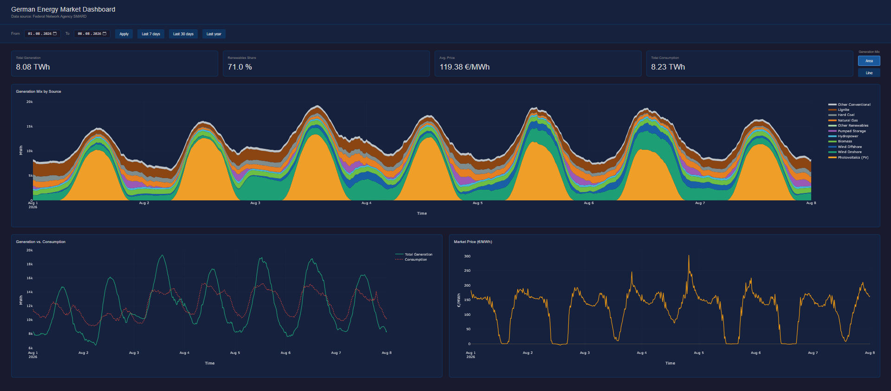

# ⚡ **SMARD Energy Data Pipeline**

     

## **Project Overview**
This data pipeline visualizes the data of the German energy market in a dashboard. It gives an overview of the generated and consumed power, the usage of the different energy sources and the market price for Germany.

The energy market data come from [Bundesnetzagentur | SMARD.de](https://www.smard.de/home), the website of the German Federal Network Agency. The data are published under the CC BY 4.0 licence.

## 📁 Repository Structure

## 🏗️ Architecture & Technologies

## 🚀 Getting started

## 💻 Local Deployment

## ☁️ AWS Deployment